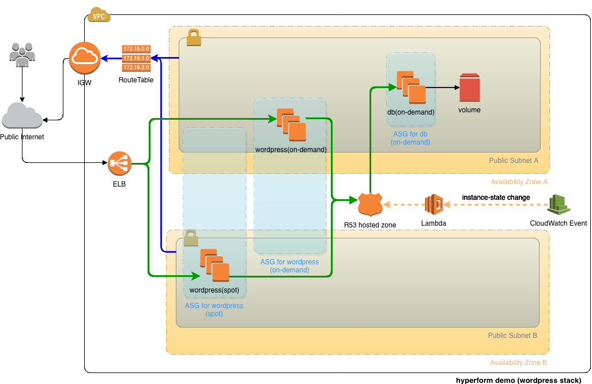

# Deploy Stack 'wordpress'

Now let's deploy a Wordpress+MySQL stack with ELB/ASG/Volume/Secrets, which is much more complicate than stack 'nginx'.


## Prepare
Secrets file:
```
[root@centos my-first-project]# echo 'aaabbbccc' > mysql_root_password.txt
[root@centos my-first-project]# echo 'dddeeefff' > wp_db_password.txt
```

Cert files:
```
[root@centos my-first-project]# wget https://raw.githubusercontent.com/hyperhq/docs.hyper.sh-hyperform/master/01-GettingStarted/03-first-project/cert/example.io.crt
[root@centos my-first-project]# wget https://raw.githubusercontent.com/hyperhq/docs.hyper.sh-hyperform/master/01-GettingStarted/03-first-project/cert/example.io.key
```

Compose File:
```
[root@centos my-first-project]# wget https://raw.githubusercontent.com/hyperhq/docs.hyper.sh-hyperform/master/01-GettingStarted/03-first-project/wordpress.yaml
```


## Do Deploy
**Note: Environment variable 'ZONE' needs to be set for wordpress.yaml. Please replace the variables with your real values.**
```
[root@centos my-first-project]# export ZONE=$THE_AZ_YOU_CHOSE
```

```
[root@centos my-first-project]# hf stack deploy -c wordpress.yaml
```


## Verify
```
# list stacks
[root@centos my-first-project]# hf stack ls
PROJECT             NAME                SERVICES
my-first-project    nginx               1
my-first-project    wordpress           2

# list services
[root@centos my-first-project]# hf service ls
STACK               NAME                REPLICAS/SPOT       IMAGE               DNSNAME                                                               
nginx               nginx               1/0                 nginx:alpine                                                                              
wordpress           db                  1/0                 mysql:5.7                                                                                 
wordpress           wordpress           2/1                 wordpress:latest    my-first-project-wordpress-lb-451438781.us-east-2.elb.amazonaws.com   443,80
```

Now you can access the wordpress in a web browser via 'DNSNAME' (In this demo it's `my-first-project-wordpress-lb-451438781.us-east-2.elb.amazonaws.com`).

```
# list containers
[root@centos my-first-project]# hf ps
STACK               SERVICE             ZONE                INSTANCE              PUBLIC IP           CONTAINER ID        IMAGE               COMMAND                  CREATED             STATUS              PORTS                               NAMES
wordpress           db                  us-east-2b          i-0c320ccbbb2222c75   13.58.28.234        26084fb98d79        mysql:5.7           "docker-entrypoint.s…"   About an hour ago   Up About an hour    0.0.0.0:3306->3306/tcp, 33060/tcp   wordpress.db.i-0c320ccbbb2222c75
wordpress           wordpress           us-east-2c          i-00c72335fe3b0d74f   18.218.150.57       200a10c0571b        wordpress:latest    "docker-entrypoint.s…"   About an hour ago   Up About an hour    0.0.0.0:80->80/tcp                  wordpress.wordpress.i-00c72335fe3b0d74f
nginx               nginx               us-east-2a          i-07fe9398b73b4d35a   18.220.171.138      fec4aa917a4d        nginx:alpine        "nginx -g 'daemon of…"   About an hour ago   Up About an hour    0.0.0.0:8000->80/tcp                nginx.nginx.i-07fe9398b73b4d35a
wordpress           wordpress           us-east-2b          i-09f96224cd8f799a9   18.218.132.142      b85d7a2d912e        wordpress:latest    "docker-entrypoint.s…"   About an hour ago   Up About an hour    0.0.0.0:80->80/tcp                  wordpress.wordpress.i-09f96224cd8f799a9
```


## Architecture of 'wordpress' Stack


