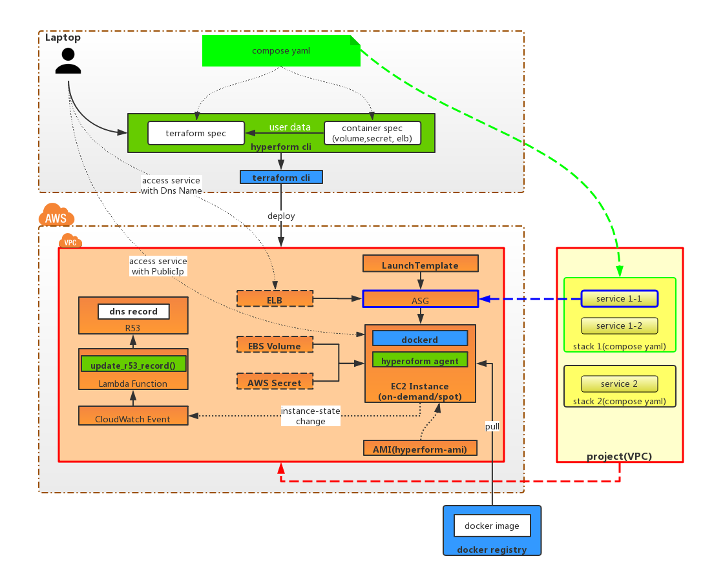

# Concepts

## Overview
Unlike other "infrastructure-as-code" tools that configure cloud VMs, Hyperform turns the IaaS cloud into a container-native workflow.

Hyperform deploy applications in the light of predefined [compose file](../03-Reference/compose_file).

## Hyperform Objects

The basic Hyperform objects include:

- [Container](01-container.md)
- [Service](02-service.md)
- [Stack](03-stack.md)
- [Project](04-project.md)

Broadly speaking, a service is composed of one or more containers, a stack is composed of one or more services, and a project is composed of one or more stacks.

In addition, Hyperform could also utilize some other resources. They include:

- [Volume](05-additional-resources/01-volume.md)
- [Secret](05-additional-resources/02-secret.md)
- [ELB](05-additional-resources/03-elb.md)
